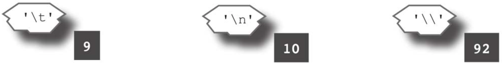

# char类型

字符串通常用于表示一系列文本字符，而Rust的char类型则用于表示单个字符。

```rust
fn main() {
    println!("这里输入你的代码!");
}
```

字符串字面量由双引号（"）包围，但char字面量由单引号（'）包围。Rust程序几乎可以使用地球上任何语言的任何字符，因为Rust使用Unicode标准来存储char。chart被保存为数字代码，而不是字符本身，如果你把char传递给println!宏（println!(”{}”, ‘A’ as u8);），你会在输出中看到数字代码，而不是原始字符。



与字符串字面量一样，转义序列也可以用在char字面量中，用来表示程序代码中难以包含的字符：
