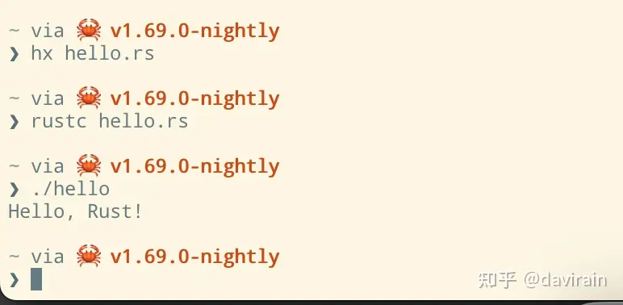

# 编译Rust代码

我们与Rust Playground的互动包括输入代码并神秘地运行它们。既然我们已经在你的电脑上安装了Rust，现在是时候仔细看看它是如何工作的了。计算机实际上是不能直接运行Rust代码的。在此之前，我们需要获取源代码文件并进行编译：将其转换为CPU可以执行的二进制格式。

hello.rs → Compiler → Executable file → Computer run this program

让我们尝试使用新安装好的Rust来编译和运行我们之前的例子“Hello，Rust！”。

①　使用你喜欢的文本编辑器，将我们之前的"Hello，Rust！"代码保存成名为hello.rs的纯文本文件。

②　打开一个新的终端或命令提示窗口。

③　在终端上，切换到保存hello.rs的目录。

④　运行rustc hello.rs编译源代码。这将向当前目录添加一个可执行文件。在macOS或Linux上，可执行文件将命名为hello。在Windows上，可执行文件将命名为hello.exe。

⑤　运行可执行文件。在macOS或Linux上，输入./hello（意思是“在当前目录中运行一个名为hello的程序”）即可。在Windows上，只需输入hello.exe。

