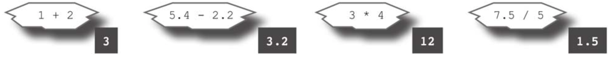

# 数学运算与比较

Rust的基本数学运算符的工作方式与大多数其他语言一样。符号+表示加法，–表示减法，*表示乘法，/表示除法。

你可以使用<和>来比较两个值，看看其中一个值是否小于或大于另一个值。你可以使用==（这是两个等号）来查看两个值是否相等，以及！=（这是一个感叹号和一个等号，读作“不等于”）来查看两个值是否不相等。<=测试第二个值是否大于或等于第一个值，>=测试第二个值是否小于或等于第一个值。比较结果是一个布尔值，要么是true，要么是false。
