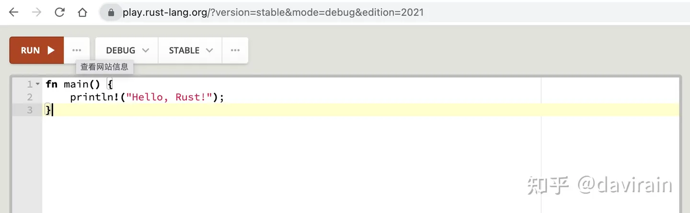
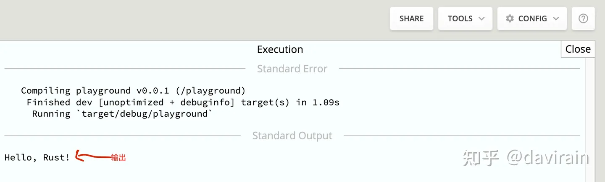

# Rust Playground

尝试Rust的最简单的方法是在你的Web浏览器中访问Rust playground(。在那里，Rust团队设置了一个简单的编辑器，你可以输入Rust代码并在他们的服务器上运行，结果就显示在浏览器上。 （当然，只有当你有稳定的互联网连接时，这才有效。如果没有的话，请参阅本章的“在你的计算机上安装Rust”节了解如何直接在你的计算机上下载和运行Rust编译器。然后使用这个编译器运行以下示例。）



我们现在试试看！


①　在浏览器中打开 Rust playground 。（如果你看到的和屏幕截图不太一样，不用担心，这只是意味着自本书出版以后，他们的网站得到了改善！）

②　删除编辑区中的任何代码，然后输入：

```rust
fn main() {
    println!("Hello, Rust!");
}
```

别担心，我们将在下面解释这是什么意思。

③　单击Run按钮。

你应该看到“Hello，Rust!”显示在屏幕底部。恭喜你，你刚刚运行了第一个Rust程序！

我们会解释一下我们刚才做了什么。


