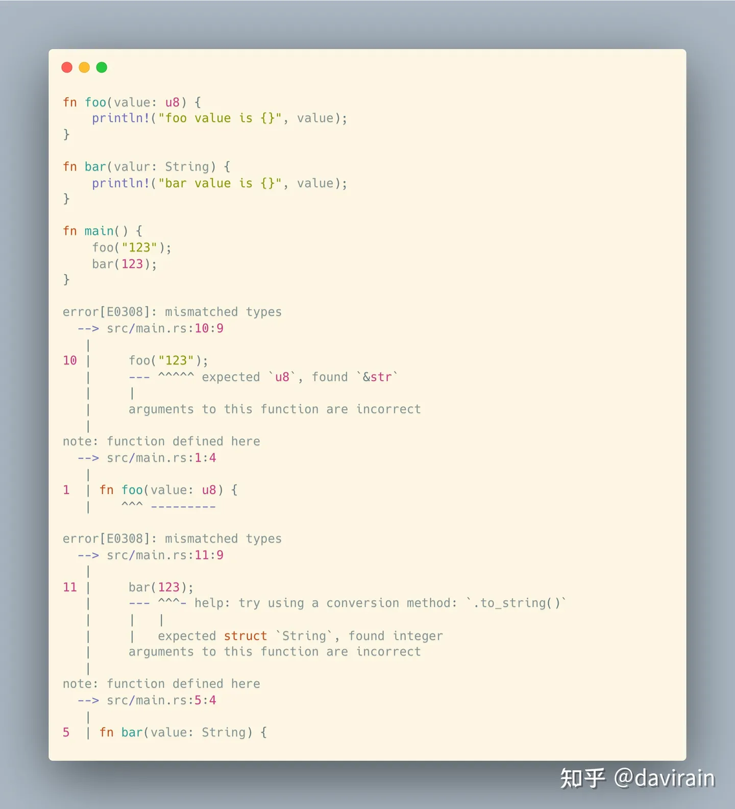
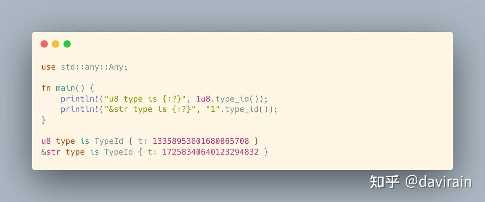

# 类型

这里有两个函数一个是foo，接受的参数是u8, 另一个函数bar接受的参数是String，这两个函数只是简单的打印出来数值。我们可以看到当传递给foo的是一个字面量“123”， 而不是数字123。而bar接受的参数是String，但是传递的参数是123数字而不是字符串。可以看到Rust会报错说类型不匹配的错误。还可以看到Rust会给出改进建议。

Rust会打印两条错误消息，一个函数调用有一条，程序甚至不能运行！

你周围的事物通常可以根据它们的用途分为不同的类型。你早餐不吃汽车或卡车（因为它们是交通工具），你也不会开着煎蛋卷或一碗麦片去上班（因为它们是早餐食品）。

同样，Rust中的值都被划分为不同的类型，这些类型指定了这些值的用途。整数可以用在数学运算中，但字符串不行。字符串可以大写，但是数字不能。等等这些。

Rust是静态类型的，这意味着它甚至在程序运行之前就知道值的类型是什么。函数期望它们的参数具有特定的类型，它们的返回值也具有类型（可能与参数类型相同，也可能不同）。如果你不小心在错误的地方使用了错误类型的值，Rust会给你一个错误消息。这是一件好事：它让你在用户发现问题之前就发现了问题！

Rust是静态类型的。如果你在错误的位置使用了错误的值类型，Rust会告诉你。

我们还可以使用Rust中的type_id方法查看不同的类型，在rust中每个类型的typeid是不一样的。

这里引入了std::any::Any,这是因为需要调用type_id方法，Rust的基本类型都实现了Any trait。

可以看到运行后的结构，u8类型和&str的type_id是不一样的。
