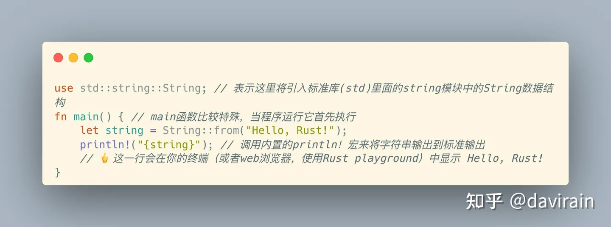

# 这一切意味着什么

你刚刚运行了你的第一个Rust程序！现在让我们看一下代码并弄清楚这一切意味着什么……




Rust文件几乎总是有一个或多个use语句。每个文件都需要导入其他crate，然后才能使用其他crate里包含的代码。一次加载计算机上的所有Rust代码将导致一个大的、慢速的程序，因此你可以指定只导入需要的crate。


每个Rust文件的最后一部分都是实际代码，它通常被分割成一个或多个function（函数）。function是由一行或多行代码组成的组，可以从程序中的其他位置调用（运行）。当一个Rust程序运行时，它会寻找一个名为main的函数并首先运行它，这就是为什么我们将这个函数命名为main。

典型的Rust文件布局你很快就会习惯在几乎每个Rust文件中看到这两个部分按此顺序排列：

1.任何use语句

2.实际代码

```rust
use std::string::String;

fn main() {
    let s = String::from("Hello, World!");
    println!("{s}");
}
```

俗话说：“万物各得其所”，Rust是一种非常一致的语言。这是好事：你经常会发现你只需要知道在项目中何处查找给定的代码段，而不用总想着它

> 放松 如果你现在不明白这些，不用担心！我们将在接下来的几页中详细介绍所有内容。
